# Integrador M7

## Aplicacion web para gestion de usuarios y datos.

    Desarrollada con Node, 

    Proyecto ABP Modulo 7

    https://github.com/milekill/integrador2.git

    03-09-2026 Valparaíso, Chile.

    Andreas Müller S.

Versión:1.0.2.1

*   Requisitos del sistema
    -   VSCode
    -   Node.js: Versión 18.x, 20.x o superior recomendada.
    -   npm: Viene incluido con la instalación de Node.js.
        
*   Sistema operativo: 
    -   Windows, macOS o Linux.
    -   Espacio en disco: Menos de 50 MB para dependencias básicas.
        
*   Instrucciones de instalación
    -   Descarga e instala Node.js desde el sitio oficial de Node.js.
    -   Abre tu terminal o consola y verifica la instalación con ```node -v``` y ```npm -v.```
    -   Crea una carpeta nueva para tu proyecto y entra en ella: ```mkdir mi-app-express``` ```cd mi-app-express```
    -   Instala las dependencias del proyecto en tu carpeta.

*   Ejemplos de uso (Servidor básico con Express)
    -   Ejecuta la aplicación en tu terminal: ```npm run dev```
    -   Abre tu navegador web y ingresa a los siguientes enlaces:
        -   http://localhost:3000 para ver la pagina de inicio con HTML.
        -   http://localhost:3000/dbpg Base de datos con dbpg PostgreSQL.
        -   http://localhost:3000/usuarios Mostrar Usuarios con dbpg PostgreSQL.
        -   http://localhost:3000/Usuarios?nombre=Juan Buscar Usuarios por nombre con dbpg PostgreSQL.
---  
---
1. Conexión a una base de datos (Lección 1)

    - Crear la base de datos y al menos 1 tabla principal (usuarios o equivalente).
        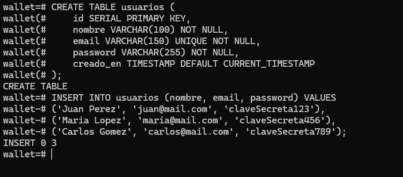 <br>

    - Utilizar mysql2, pg o el paquete ORM elegido para establecer la conexión.
        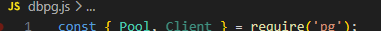 <br>

    - Almacenar credenciales en variables de entorno.
        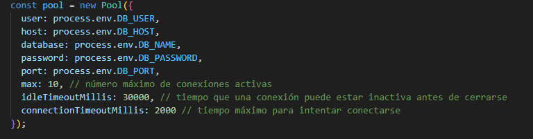 <br>


    - Archivo .env con las claves ocultas.
        <br> 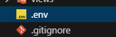 <br>

    - Log en consola al conectar con éxito.
        <br> 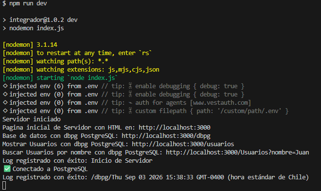 <br>

    - ¿Por qué elegiste ese cliente de conexión?

        - Ligero y Nativo: node-postgres (pg) es el driver de bajo nivel sobre el cual se construyen la mayoría de los ORMs de Node (como Sequelize o TypeORM). Al usarlo directamente, evitamos sobrecarga (overhead) de código y entendemos el comportamiento real de las consultas SQL.

        - Uso de Pool de Conexiones: El objeto Pool reutiliza conexiones existentes en lugar de abrir y cerrar una nueva conexión en cada solicitud HTTP. Esto mejora drásticamente el rendimiento del servidor bajo carga constante.

    - ¿Cómo se protegen los datos sensibles?
        
        - Inyección de Dependencias vía Proceso: Las credenciales (usuario, contraseña, host) no están escritas directamente en el código fuente (hardcodeado). Se leen directamente de la memoria del sistema operativo en tiempo de ejecución usando process.env.

        - Aislamiento del Entorno: El archivo .env actúa como un entorno local cerrado. Al excluirlo del repositorio mediante .gitignore, evitamos filtraciones accidentales de credenciales críticas en servidores públicos como GitHub, permitiendo además cambiar de entorno (desarrollo, pruebas, producción) simplemente modificando los valores del archivo sin tocar el código.
---
---

2. Obtención de información desde una base de datos (Lección 2)

    - Crear una ruta GET /usuarios que devuelva los datos de la tabla.
        ingresar a para ver todos los usuarios: `http://localhost:3000/usuarios`
        <br>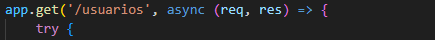<br>

    - Procesar los resultados antes de enviarlos (evitar contraseñas o datos sensibles).
        Se eleminar la muestra de las password de casa usuario:
        <br>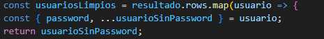<br>

    - Validar errores de conexión o consulta.
    <br>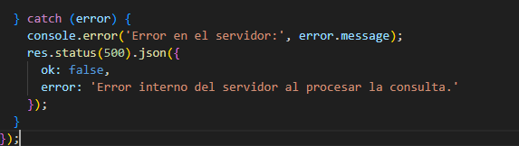<br>

    - Al menos 3 registros simulados.
    <br>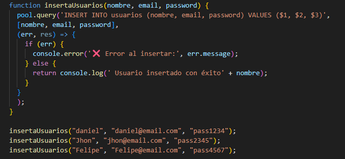<br>


    - Respuesta en JSON clara y ordenada.
    <br>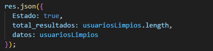<br>
    <br>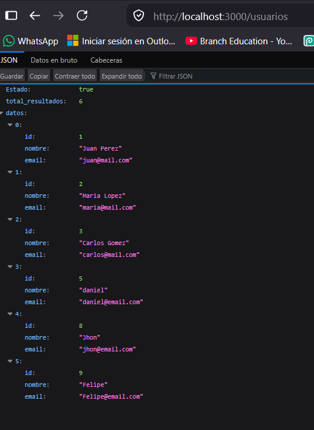<br>

    - Implementar paginación o filtrado por query params(?nombre=Juan).<br>
        ingresar nombre para buscar usuario: `http://localhost:3000/usuarios?nombre=juan`
        <br>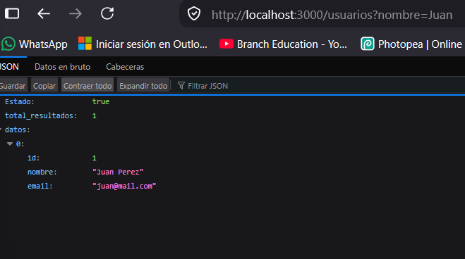<br>

---
---

3. Modificación de datos en una base de datos (Lección 3)

    - Ruta PUT /usuarios/:id para modificar un registro.
    `http://localhost:3000/usuarios/1`
    <br>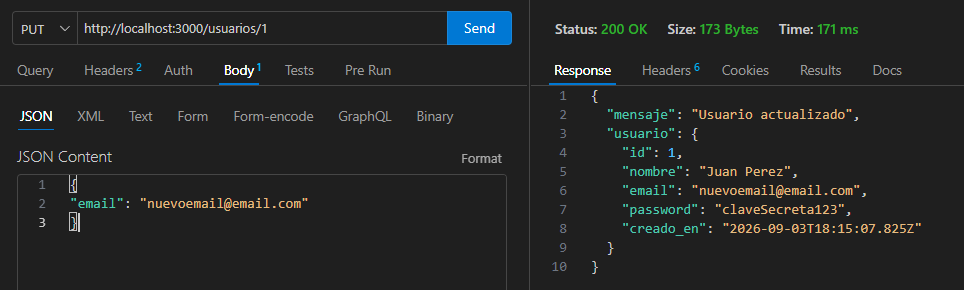<br>

    - Ruta DELETE /usuarios/:id con validación previa de existencia.
    `http://localhost:3000/usuarios/1`
    <br>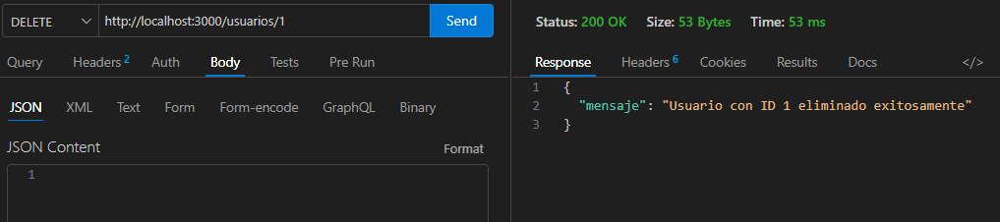<br>

    - Validar errores y devolver mensajes útiles.
    <br>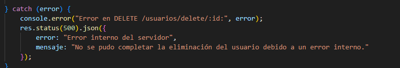<br>
    <br>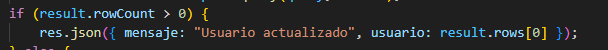<br>


    - Confirmación de éxito en ambas operaciones.
    <br>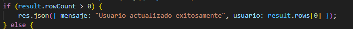<br>
    <br>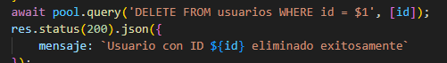<br>


    - Validación de ID existente.
    <br>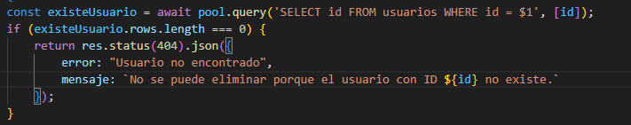<br>
    
    - ¿Por qué decidiste actualizar sólo ciertos campos?

        -  Evitar sobreescritura accidental: Si el cliente solo quiere cambiar el email, no debe verse obligado a enviar el nombre o la edad. Si enviáramos campos fijos, correríamos el riesgo de poner valores en null o sobreescribir datos válidos con datos vacíos.

        -   Eficiencia y rendimiento: Generar la consulta SQL dinámicamente (UPDATE usuarios SET nombre = $1 ...) asegura que la base de datos solo procese e indexe los cambios estrictamente necesarios, reduciendo el tráfico de red y la carga en el motor PostgreSQL.

        - Flexibilidad (Comportamiento PATCH en un PUT): Aunque teóricamente PUT reemplaza el recurso completo, en entornos prácticos reales es mucho más seguro y óptimo permitir actualizaciones parciales para no forzar al frontend a realizar consultas GET previas innecesarias solo para rellenar el formulario.


    - ¿Qué validaciones aplicaste para evitar errores?

        - Validación del tipo de dato del parámetro (:id): Compruebo que el ID sea un número entero positivo antes de tocar la base de datos. Esto evita errores de sintaxis en PostgreSQL cuando se inyectan cadenas de texto (como /usuarios/abc).
        - Verificación de existencia previa (404 Not Found):
            - En el PUT, realizo un SELECT rápido para garantizar que el recurso existe antes de transformarlo.
            - En el DELETE, utilizo la cláusula RETURNING * combinada con rowCount === 0. Esto es atómico, rápido y evita borrar registros inexistentes sin lanzar un error de servidor.


---

4. Transaccionalidad (Lección 4)

    - Implementar una operación simulada que involucre al menos 2 acciones consecutivas (por ejemplo, registrar un usuario y crear su historial).
    <br>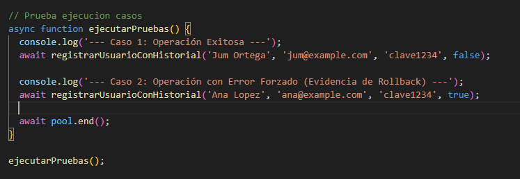<br>
    <br>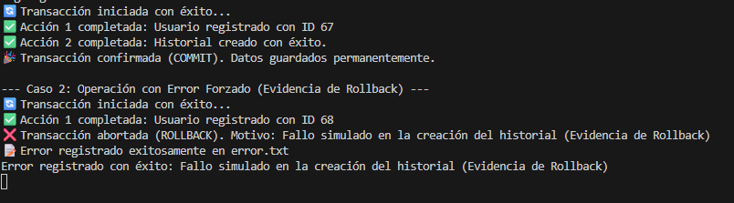<br>
    

    - Asegurar rollback si alguna falla.
    <br>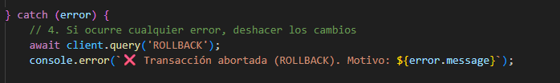<br>

    - Log de éxito o error claro.
    <br><br>

    - Evidencia de rollback si se fuerza un error.
    <br>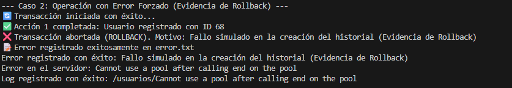<br>

    - Log en archivo de las transacciones fallidas (similar al log.txt previo).
    <br>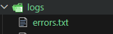<br>
    <br>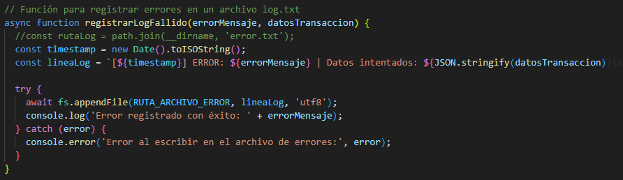<br>

---

5. Acceso a datos con ORM (Lección 5)

    - Instalar e inicializar ORM.
    para instalar ORM:
    `npm install sequelize pg pg-hstore`
    <br>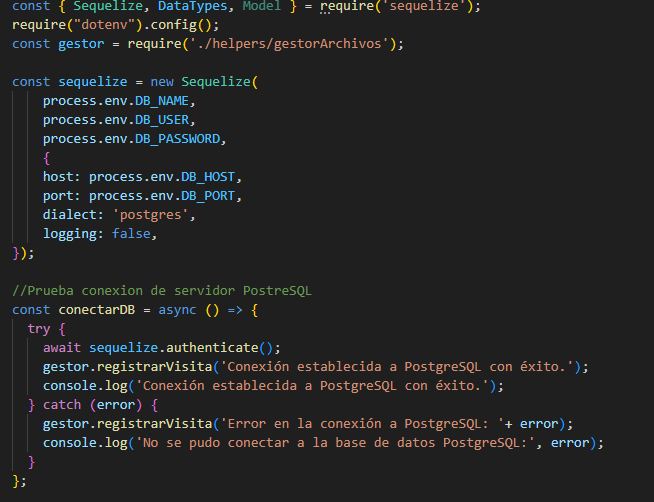<br>

    - Definir al menos 1 modelo (User).
    <br>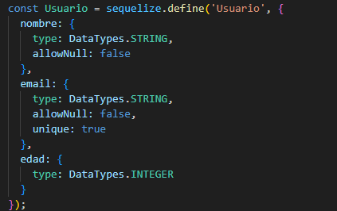<br>

    - Crear una ruta que devuelva los usuarios usando métodos del ORM.
    <br>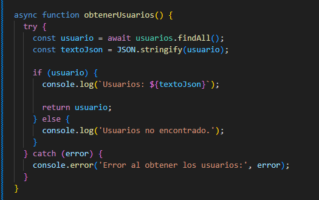<br>
    <br>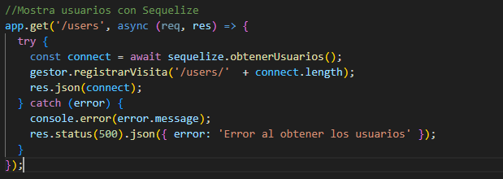<br>

    - Comparación de resultados entre SQL manual y ORM.
        Característica Cliente SQL Tradicional (ej. pg, mysql2)ORM (Sequelize)
        Código de consulta SELECT id, name, email, "createdAt" FROM "Users";User.findAll();
        Formateo de datos Devuelve filas de texto plano que debes mapear manualmente si requieres lógica de negocio. Devuelve instancias de clase con métodos útiles (ej. user.save()).
        Seguridad (Inyección SQL) Requiere sanitizar manualmente usando consultas parametrizadas ($1, $2). Sanitiza y protege contra inyección SQL de forma nativa y automática.
        Mutación de datos (Crear)INSERT INTO "Users" (name, email) VALUES ($1, $2) RETURNING *;User.create({ name, email });


    - ¿Qué ventaja encontraste usando ORM frente al cliente SQL tradicional?
        - Abstracción de la Base de Datos: Si hoy usas PostgreSQL y mañana decides cambiar a MySQL o SQLite, no necesitas reescribir tus consultas SQL. Solo cambias el dialect en la configuración de Sequelize.
        - Código más Limpio y Mantenible: Reemplazas cadenas de texto SQL (que el editor a veces no resalta ni autocompleta) por métodos de JavaScript puros (findAll, findOne, create, update). Esto reduce errores sintácticos.
        - Validación de Datos Integrada: El ORM te permite validar correos, longitudes de strings o campos nulos directamente en la capa de la aplicación (en la definición del modelo) antes de siquiera tocar la base de datos.
        - Manejo Automático de Relaciones: Configurar un JOIN complejo en SQL tradicional requiere muchas líneas. En Sequelize se resuelve asociando los modelos (User.hasMany(Post)) y usando la opción { include: Post } en la consulta.

---

6. Manejo de relaciones en un ORM (Lección 6)

    - Crear al menos 1 relación (por ejemplo, Usuario tiene muchos Pedidos).
    <br>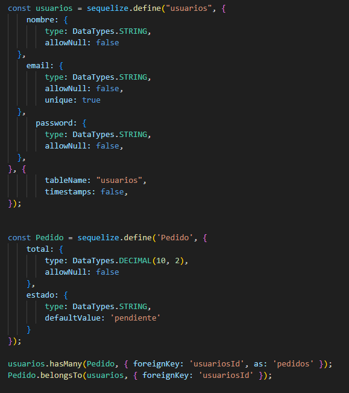<br>

    - Crear una ruta que devuelva el usuario y sus pedidos en una sola consulta.
        `http://localhost:3000/users/:id/pedidos`
        <br>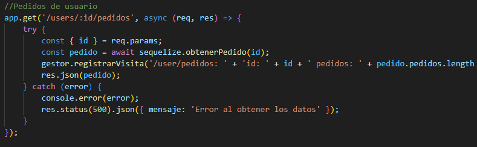<br>

    - Uso de include o equivalente para traer relaciones.
    <br>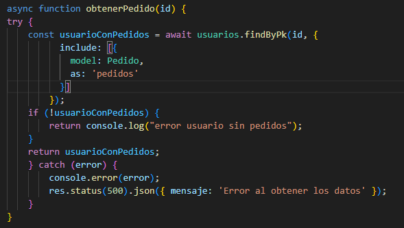<br>

    - Al menos 2 modelos relacionados.

    - Mostrar los datos anidados en una tabla en HTML o como JSON ordenado.+
    `http://localhost:3000/demo`
    <br>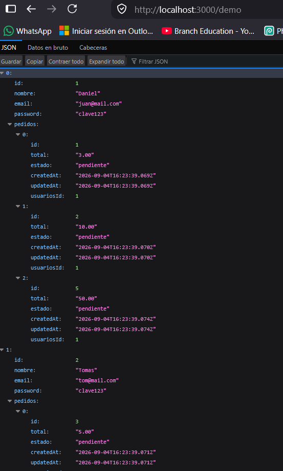<br>

---
